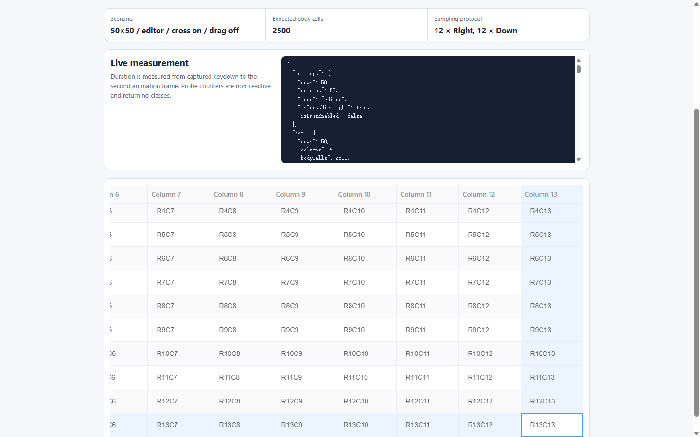

# FlTable 50×50 键盘焦点性能基线

记录日期：2026-07-20
诊断范围：Playground 与诊断产物
组件改动：无；本轮未修改 `packages/components/table/**`、公共 API 或组件行为

## 结论

卡顿可以稳定复现，并且已经形成“键盘操作 → 主线程长任务 → Vue/Element Plus 全表更新 →
FlTable 源码路径”的证据链。

最明确的事实是：每次有效方向键都会重新调用 **2,500 次**表体 `cellClassName`；开启交叉
高亮后，还会额外调用 **50 次**表头 `headerCellClassName`。在带 CPU sampling 的 Performance
Trace 中，四组的 24 次移动全部超过 50 ms。`editor` 模式还会经过 2,500 个编辑器 endpoint
的查找和编辑桥接组件更新，主线程渲染占比从 plain 的 5.7%–8.3% 上升到 30.4%–42.8%。

建议首轮先处理全表 class 重算和编辑器 registry；条件滚动紧随其后。虚拟化不是本次
50×50 回归的首选修复。

## 诊断页

独立路由：`/table-performance`

支持下列可复现参数：

- `rows=50`、`cols=50`
- `mode=plain|editor`
- `cross=0|1`
- `drag=0|1`

默认值为 `50×50 / plain / cross off / drag off`。表格固定高 520 px，每列固定宽 128 px，
因此 12 次向右和 12 次向下同时覆盖视口内移动与横纵滚动边界。

页面实现位于 `play/src/views/table-performance-view.vue`，使用 Vue 3
`<script setup lang="ts">` 和浅层响应式固定数据。页面提供：

- 50 行、50 个可见数据列、2,500 个表体单元格；
- plain 模式的纯文本单元格；
- editor 模式的 2,500 个 `FlTableEditor + FlInput`；
- 非响应式 class 回调计数器；
- 从 `window` 捕获阶段 keydown 到第二个 `requestAnimationFrame` 的逐键耗时；
- p50、p95、最大值、16.7 ms/50 ms 超限数；
- 稳定 `data-testid` 与 `window.__flTablePerformance` 诊断接口。




四组最终都停在 R13C13，说明 12 次 `ArrowRight` 和 12 次 `ArrowDown` 均只移动一格，且没有
自动进入编辑态。

## 采样方法

- 浏览器：Google Chrome 150.0.7871.125，独立临时 profile，headless new；
- 视口：1440×900，device scale factor 1；
- CPU：1×，没有 CPU 降速；
- 网络：没有设置网络限速，页面来自同一本地 Vite build；
- 预热：点击 R1C1 后执行一次 Right/Left，再清空指标；
- 正式操作：12 次 `ArrowRight`，再 12 次 `ArrowDown`；
- Trace：`devtools.timeline`、frame、V8 high-resolution CPU profiler、latencyInfo；
- 原始 Trace 通过 Chrome DevTools Protocol `ReturnAsStream` 导出，并使用 gzip level 9 压缩。

可重复执行：

```powershell
node scripts/diagnostics/capture-fl-table-performance.mjs
node scripts/diagnostics/analyze-fl-table-performance.mjs
```

采样脚本：`scripts/diagnostics/capture-fl-table-performance.mjs`；独立解析脚本：
`scripts/diagnostics/analyze-fl-table-performance.mjs`。

说明：页面耗时是在启用 CPU sampling 的 Trace 内测得，绝对值会包含分析器开销，适合本次
同构场景的比较和证据定位，不应直接当作生产设备的用户耗时。editor 两组各只录制一次，
`cross on` 的中位数低于 `cross off` 属于单次运行波动，不能解释为交叉高亮带来性能提升。

## 实测结果

### 页面逐键指标

| 场景               |  DOM / editor |        p50 |        p95 |       最大 | >16.7 ms | >50 ms | body/header 回调/键 |
| ------------------ | ------------: | ---------: | ---------: | ---------: | -------: | -----: | ------------------: |
| plain / cross off  |     2,500 / 0 |   448.6 ms |   515.2 ms |   539.1 ms |    24/24 |  24/24 |           2,500 / 0 |
| plain / cross on   |     2,500 / 0 |   680.3 ms |   750.1 ms |   764.1 ms |    24/24 |  24/24 |          2,500 / 50 |
| editor / cross off | 2,500 / 2,500 | 1,744.4 ms | 2,104.6 ms | 2,131.6 ms |    24/24 |  24/24 |           2,500 / 0 |
| editor / cross on  | 2,500 / 2,500 |   564.0 ms |   963.3 ms | 1,020.3 ms |    24/24 |  24/24 |          2,500 / 50 |

### Trace 主线程指标

下表的阶段占比是互斥计算：子级 painting/rendering/GC 会从包围它的 scripting 中扣除，
因此可以相加。Long Task 是合并嵌套 `RunTask` 后持续至少 50 ms 的主线程任务；一个按键可能
产生多个后续任务。

| 场景               |  主线程忙时 | Long Task / 最长 |  脚本 |  渲染 | 绘制 |   GC |
| ------------------ | ----------: | ---------------: | ----: | ----: | ---: | ---: |
| plain / cross off  | 10,267.2 ms |    25 / 492.8 ms | 91.3% |  5.7% | 1.2% | 1.2% |
| plain / cross on   | 16,790.9 ms |  26 / 1,096.9 ms | 88.0% |  8.3% | 1.4% | 1.0% |
| editor / cross off | 55,252.9 ms |  66 / 2,791.2 ms | 67.8% | 30.4% | 0.4% | 1.1% |
| editor / cross on  | 21,904.2 ms |  85 / 1,602.0 ms | 54.7% | 42.8% | 0.9% | 1.7% |

关键浏览器事件总量：

| 场景               | `UpdateLayoutTree` | `Layout` |  `Layerize` |  `Paint` |
| ------------------ | -----------------: | -------: | ----------: | -------: |
| plain / cross off  |            64.5 ms |  36.9 ms |    341.1 ms | 187.8 ms |
| plain / cross on   |           281.9 ms |  52.5 ms |    639.2 ms | 373.9 ms |
| editor / cross off |           125.1 ms |  57.6 ms | 15,859.6 ms | 325.4 ms |
| editor / cross on  |           143.4 ms |  28.8 ms |  8,656.7 ms | 268.2 ms |

独立的 Chrome DevTools Performance 分析也得到同方向结果：其中一次 plain/cross-off 物理
keydown 被归类为 608 ms INP，包含 397 ms processing 和 210 ms presentation；DOM Size
insight 统计到 7,875 个元素，并记录一次影响 7,670 个元素的 167 ms 样式重算。该记录用于
交叉验证；四组可复现基线以本目录的原始 CDP Trace 为准。

完整机器可读汇总见
[trace-analysis.json](./artifacts/trace-analysis.json) 和
[capture-summary.json](./artifacts/capture-summary.json)。

## 证据链

### 1. activeCell 引发全表 class 路径

**实测事实**

- 每个有效方向键固定调用 2,500 次表体 class 探针；
- cross on 额外固定调用 50 次表头 class 探针；
- CPU sampling 命中 `resolveCrossClass`、`resolveByScope`、`mergeClass` 和 Element Plus
  `getCellClass`；
- plain/cross-on 比 off 多出样式、Layerize 和 Paint 工作。

**源码关联**

- `activeCell` 是响应式 ref：`packages/components/table/src/table.vue#L128`；
- 每个 cell class 都读取 `activeCell` 并合并 class：
  `packages/components/table/src/table.vue#L804`；
- 合并函数作为 ElTable 的 `cellClassName`/`headerCellClassName` 输入：
  `packages/components/table/src/table.vue#L1575`。

**源码推断**

方向键更新 `activeCell` 后，依赖它的 ElTable class 计算会使所有 2,500 个表体单元格重新走
class 回调。探针计数已直接确认调用规模，因此该路径是当前最可信的 O(行×列) 放大器。

### 2. editor registry 全量扫描与组件更新

**实测事实**

- editor 页面有 2,500 个编辑桥接实例；
- editor Trace 的 CPU sampling 命中 `findEditorForActiveCell`、`findEditorsInCells`、
  `blurActiveEditor`、`closeEditor`、`changeRef`、`mergeComponentExpose` 和 Vue `updateProps`；
- editor 的 `Layerize` 总量达到 8.7–15.9 秒，显著高于 plain 的 0.3–0.6 秒。

**源码关联**

- registry 是响应式数组，注册和注销都复制整个数组：
  `packages/components/table/src/table.vue#L133`；
- 活动单元格查找会 `filter` 全部 endpoint，并对候选 DOM 执行 `contains`：
  `packages/components/table/src/table.vue#L608`；
- 每个方向键先检查 panel，再调用 `blurActiveEditor`：
  `packages/components/table/src/table.vue#L1126`。

**源码推断**

每次方向键至少通过 panel 检查和 blur 路径查找活动 editor，当前实现会重复扫描 2,500 个
endpoint。挂载阶段的逐次数组复制还会形成 O(n²) 累计注册成本；这部分发生在预热前，未计入
正式 24 键 Trace，但可由实现直接推出。editor 的主要卡顿还包含 2,500 个 FlInput 组件的
props/ref/layer 更新，不能只归因于 registry。

### 3. 无条件 `scrollIntoView`

**实测事实**

- CPU sampling 命中 `scrollActiveCellIntoView` 和浏览器原生 `scrollIntoView`；
- 12 次向右和 12 次向下从视口内移动过渡到真实横纵滚动，滚动后命中次数增加；
- cross-on plain Trace 中 `scrollIntoView` 占 Falcon 相关 inclusive samples 的 1.4%。

**源码关联**

方向键在 `nextTick` 后无条件调用 `scrollActiveCellIntoView`，后者总是调用
`scrollIntoView({ block: 'nearest', inline: 'nearest' })`：
`packages/components/table/src/table.vue#L670` 和
`packages/components/table/src/table.vue#L1144`。

**源码推断**

`nearest` 可以避免不必要的可见位移，但调用前仍要定位 cell，浏览器还可能执行命中测试和
同步几何计算。它不是第一主因，但适合在 class/registry 修复后继续减少每键固定工作。

### 4. 行列位置与 class 分配

**实测事实**

CPU sampling 还命中 `resolveActiveCellPosition`、`resolveVisibleColumns`、`readRowKey` 和
`mergeClass`，但占比低于前三条路径。

**源码关联**

每次定位通过 `findIndex` 查行、重新 `flatMap` 可见列并再次查列：
`packages/components/table/src/table.vue#L511`。

**源码推断**

50×50 下它们不是首轮瓶颈。只有在前两项完成后仍出现在新 Trace 顶部，才值得增加位置索引
或减少 class 合并分配。

## 优化方案与优先级

### P0：焦点视觉从全表 `cellClassName` 重算中解耦

保留 `activeCell` 作为语义状态，但不要让它成为 ElTable 全表 class 回调的响应式依赖。

- 保存旧/新活动位置，只差量移除和添加焦点 class；
- cross off 只更新旧/新两个 cell，稳态工作量 O(1)；
- cross on 只更新旧/新行列及表头，稳态工作量 O(行+列)；
- 数据、排序、固定列克隆或列结构变化时执行一次受控重建；
- 用户传入的 `cellClassName`/`headerCellClassName` 仍按原契约工作，焦点移动不再迫使其全量执行。

首个修复后的明确验收指标：plain/cross-off 的探针应从 2,500 次/键降为 0；cross-on 也
不应再触发用户 class 回调的全表重算。

### P0：将 editor registry 改为非响应式单元格索引

- 用非响应式 `Map`/`WeakMap` 按所属 `td` 或稳定 cell key 保存 endpoint 集合；
- 单独保留 `id → endpoint` 以便 O(1) 注销，避免注册/注销数组复制；
- 查活动 editor 时直接按目标 cell 读取候选，只对固定列克隆等少量候选执行现有优先级排序；
- 保留 panel、close、blur、fixed clone 和 priority 语义。

目标是把 endpoint 注册总成本从 O(n²) 降为 O(n)，按键查找从 O(2,500) 降为接近 O(1)。

### P1：仅越界时滚动，并合并到同一帧

- 先比较目标 cell 与表体横纵 viewport 的矩形；
- 完全可见时不调用 `scrollIntoView`；
- 越界时只修改必要的 table body scrollTop/scrollLeft；
- 将差量 class 更新和滚动安排到同一个 animation frame，集中一次读布局、一次写布局。

### P2：根据复测决定是否建立位置索引

如新 Trace 仍命中行列定位，可缓存 `rowKey → rowIndex` 和 `columnKey → visible column`，仅在
数据/列结构变化时重建。`mergeClass` 的临时数组/字符串分配也应等 P0 完成后再决定。

### P3：虚拟化仅作为大规模长期方案

50×50 本身不应依赖虚拟化才能完成单格焦点移动。虚拟化会引入编辑状态、固定列、可访问性
和滚动定位的新契约，不纳入首轮修复。

## 下一轮验证标准

1. 使用同一页面、同一 1440×900/1× 配置重跑四组；
2. 方向键仍只移动一格，不自动进入编辑态；
3. plain/cross-off 不再出现 2,500 次 class 回调；
4. editor endpoint 查找不再扫描全 registry；
5. 视口内方向键不触发滚动，边界滚动语义保持不变；
6. 对比 Long Task、阶段占比、p50/p95，并保存修复后 Trace；
7. 不以单次 editor on/off 的绝对排序下结论，至少重复三轮并报告中位数。

## 质量门禁

- `pnpm --dir play typecheck`：通过；
- `pnpm lint`：通过；
- `pnpm test`：通过，27 个文件、342 个用例；
- `pnpm play:build`：通过；
- `git diff --check`：通过；
- `pnpm format:check`：未通过，唯一命中的是本轮未修改的
  `pnpm-workspace.yaml`；排除该既有文件后，其余全部通过 Prettier 检查。

为避免夹带无关配置改动，本轮没有仅为门禁改写 `pnpm-workspace.yaml`。

## 原始产物

四份 `.trace.json.gz` 均已通过独立脚本完成 gzip 解压和 JSON 解析，并包含
`traceEvents`、`CrRendererMain` 元数据、24 个合并后的 keydown dispatch 区间和 V8 CPU
profile chunks。可在 Chrome DevTools Performance 面板使用 **Load profile** 重新导入。

| 场景               | Trace                                               | 页面指标                                             | 截图                                    |
| ------------------ | --------------------------------------------------- | ---------------------------------------------------- | --------------------------------------- |
| plain / cross off  | [trace](./artifacts/plain-cross-off.trace.json.gz)  | [metrics](./artifacts/plain-cross-off.metrics.json)  | [png](./artifacts/plain-cross-off.png)  |
| plain / cross on   | [trace](./artifacts/plain-cross-on.trace.json.gz)   | [metrics](./artifacts/plain-cross-on.metrics.json)   | [png](./artifacts/plain-cross-on.png)   |
| editor / cross off | [trace](./artifacts/editor-cross-off.trace.json.gz) | [metrics](./artifacts/editor-cross-off.metrics.json) | [png](./artifacts/editor-cross-off.png) |
| editor / cross on  | [trace](./artifacts/editor-cross-on.trace.json.gz)  | [metrics](./artifacts/editor-cross-on.metrics.json)  | [png](./artifacts/editor-cross-on.png)  |
