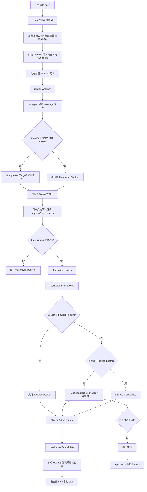

# UseDialog RPD（调用式弹窗服务）

## 1. 文档目标

定义 `useDialog` 的产品需求、API 契约与验收标准，确保调用式弹窗在
`FlDialog` 场景下可稳定用于确认、取消、关闭，以及“弹窗内部数据统一回传”。

## 2. 背景

业务在使用调用式弹窗时，经常把内容渲染为 VNode（如 `ElTable`、表单组件）。
当数据只存在于弹窗内容内部时，外部很难以统一方式获取确认结果。

本次新增需求聚焦：

1. 保持 `dialog.open(...).then(...).catch(...)` 的使用方式不变。
2. 在 `then` 中拿到确认数据，在 `catch` 中拿到取消/关闭动作。
3. 支持不依赖外部 `tableRef`，直接从 message 渲染组件内部读取数据并回传。

## 3. 目标与非目标

### 3.1 目标

1. 提供调用式 API：`open`、`closeAll`。
2. 统一 Promise 语义：`confirm -> resolve`，其他动作 `-> reject`。
3. 支持两种确认数据回传方式：
   1. `payloadResolver`（业务自定义解析）
   2. `payloadMethod`（自动调用 message 组件实例方法）
4. 覆盖表格勾选类典型场景（`ElTable#getSelectionRows`）。

### 3.2 非目标

1. 本期不新增 `alert/confirm/prompt` 快捷 API。
2. 本期不做多弹窗堆叠/队列策略改造（维持单例覆盖）。
3. 本期不修改 `FlDialog` 视觉规范。

## 4. 对外 API 契约

### 4.1 服务接口

1. `open<TPayload = void>(options?): Promise<DialogResolvePayload<TPayload>>`
2. `closeAll(reason?: DialogCloseReason): void`

### 4.2 open(options) 字段

1. `title?: string`
2. `message?: string | VNode | (() => VNode)`
3. `appendTo?: string | HTMLElement`
4. `showClose?: boolean`
5. `closeOnClickModal?: boolean`
6. `closeOnPressEscape?: boolean`
7. `beforeClose?: (action) => boolean | Promise<boolean>`
8. `dialogProps?: Partial<FlDialogProps> & Record<string, unknown>`
9. `payloadResolver?: () => TPayload | Promise<TPayload>`
10. `payloadMethod?: string`
11. `payloadMethodArgs?: unknown[]`
12. `onAction?: (action) => void`

### 4.3 Promise 语义

1. 确认按钮：`resolve({ action: 'confirm', data })`（无数据时仅 `action`）。
2. 取消/关闭/遮罩/ESC/closeAll：`reject({ action })`。
3. `payloadResolver` 或 `payloadMethod` 执行异常：`reject(error)`。

## 5. 新增需求（本次）

### 5.1 内部数据统一出口

当数据不在外部 `ref`，而在弹窗内容内部时，必须可以通过 `open().then(...)`
拿到确认数据，作为统一出口。

### 5.2 自动实例方法回传（payloadMethod）

1. `message` 为组件 VNode 时，`useDialog` 自动注入内部 ref。
2. confirm 时如果配置了 `payloadMethod`，自动调用该实例方法并回传结果。
3. 支持 `payloadMethodArgs` 透传调用参数。
4. 为兼容用户已有 ref，内部注入需采用合并 ref（不能覆盖原 ref）。

### 5.3 优先级与边界

1. 回传优先级：`payloadResolver > payloadMethod > undefined`。
2. 非确认动作不允许触发 `payloadResolver` / `payloadMethod`。
3. `payloadMethod` 找不到目标实例或方法非函数时，必须抛出明确错误。

## 6. 推荐调用方式

```ts
dialog
  .open<Row[]>({
    title: '选择用户',
    message: () =>
      h(ElTable, { data: rows }, () => [
        h(ElTableColumn, { type: 'selection', width: 52 }),
        h(ElTableColumn, { prop: 'name', label: '姓名' })
      ]),
    payloadMethod: 'getSelectionRows'
  })
  .then(({ data }) => {
    // data: Row[]
  })
  .catch(({ action }: DialogRejectPayload) => {
    // cancel | close | mask | esc | closeAll
  })
```

## 7. open 到 then 数据回传执行流程图



补充说明：

1. 数据回传优先级固定：`payloadResolver > payloadMethod > undefined`。
2. 只有 `confirm` 分支会进入 `resolveConfirmPayload`，取消/关闭不会触发数据解析。
3. 若 `payloadMethod` 缺失目标实例或方法非函数，将直接 `reject(error)`。

## 8. 实现约束

1. `useDialog` 负责实例生命周期、Promise 结算、并发覆盖、资源清理。
2. `FlDialog` 负责 UI 呈现与交互事件。
3. `dialogProps` 透传时必须过滤服务层托管字段（如 `modelValue`、事件回调等）。
4. `appendTo` 非法时回退到 `document.body`。
5. `closeAll` 在无活动实例时无副作用。

## 9. 测试验收标准

### 9.1 单测必测项

1. `open` 动态挂载与销毁正常。
2. confirm 进入 resolve；非 confirm 进入 reject。
3. `payloadResolver` 仅在 confirm 时执行。
4. `payloadMethod` 仅在 confirm 时执行。
5. `payloadResolver` 与 `payloadMethod` 同时存在时，优先前者。
6. `payloadMethod` 缺失/非函数时正确 reject error。
7. 渲染 `ElTable` 时可通过 `payloadMethod: 'getSelectionRows'`
   在 `then` 中拿到勾选行。

### 9.2 文档验收

1. `FlDialog` 文档新增 `useDialog` 章节与 API 表。
2. 新增 `useDialog` + `ElTable` 勾选回传示例。
3. 示例不依赖外部 `tableRef` 进行取值。

## 10. 迁移建议

1. 新代码优先使用 `useDialog.open`。
2. 旧路径可兼容一版后逐步迁移。
3. 业务统一采用 `then/catch` 处理结果，避免分散式事件回调。
