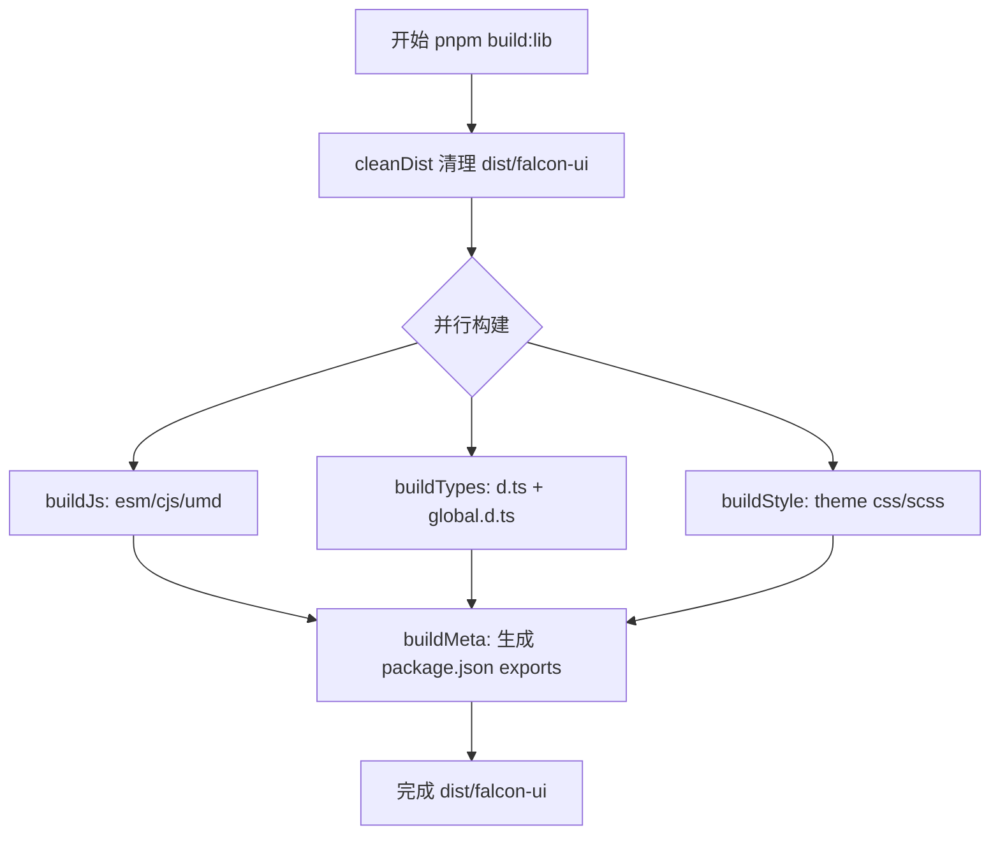

# 组件库打包流程

本文记录 Falcon UI 当前的打包流程、每个 `mjs` 构建脚本职责和核心实现点。

## 1. 一键打包命令

在仓库根目录执行：

```bash
pnpm build:lib
```

对应脚本：

- `build:lib` -> `gulp --gulpfile scripts/gulpfile.mjs build`

## 2. 总体流程

`scripts/gulpfile.mjs` 中 `build` 任务为：

1. `cleanDist`
2. 并行：`buildJs` + `buildTypes` + `buildStyle`
3. `buildMeta`

并行阶段结束后统一写发布元数据，保证 `package.json` 指向的是最新构建结果。
整个流程通过 `consola` 输出阶段/入口日志，并同步落盘到项目根 `logs/`。

## 3. 流程图（Markdown 预览可见）



## 4. 每个 mjs 做了什么

### 4.1 `scripts/build/logger.mjs`

职责：

- 提供统一日志能力：控制台彩色输出 + 文件落盘
- 提供 `withStage`、`withEntry` 包装器，自动记录开始/结束/耗时
- 提供错误提示（hint）与最终阶段耗时汇总

核心点：

1. 日志库使用 `consola`。
2. 日志文件输出：
   - `logs/build-YYYYMMDD-HHmmss.log`
   - `logs/build-latest.log`
3. 失败日志会输出阶段/入口和排查提示，便于快速定位。

### 4.2 `scripts/build/constants.mjs`

职责：

- 定义构建根路径：`rootDir`、`packagesDir`、`distPackageDir`
- 定义 JS 构建入口 `entryPoints`
- 定义 alias、external、UMD globals

核心点：

1. `entryPoints` 决定最终产物目录结构。
2. 组件 `src` 入口显式加入了 `.ts` 和 `.vue`：
   - `components/button/src/button`
   - `components/button/src/button.vue`
   - `components/input/src/input`
   - `components/input/src/input.vue`
3. 这保证 `dist/falcon-ui/esm|cjs/components/*/src` 内是编译产物，而不是源码拷贝。

### 4.3 `scripts/build/clean.mjs`

职责：

- 删除 `dist/falcon-ui` 目录。

核心点：

1. `rm(..., { recursive: true, force: true })` 幂等执行。
2. 每次打包前清理，避免旧文件污染新产物。

### 4.4 `scripts/build/build-js.mjs`

职责：

- 使用 `rolldown-vite` + `@vitejs/plugin-vue` 构建 JS 产物。
- 生成三种格式：
  - `esm`（`.mjs`）
  - `cjs`（`.cjs`）
  - `umd`（`falcon-ui.umd.js`）

核心点：

1. 逐入口构建（`runModuleBuild`），保证目录结构与入口路径一致。
2. 入口名最后一段作为文件名：
   - `components/button/src/button.vue` -> `button.vue.mjs` / `button.vue.cjs`
3. `external` 排除 `vue`、`element-plus`、`@element-plus/icons-vue`，避免重复打包依赖。
4. `sourcemap: true` 保留调试能力。
5. `emptyOutDir: false`，因为多入口多阶段输出同一 dist 根目录。

### 4.5 `scripts/build/build-types.mjs`

职责：

- 执行 `vue-tsc -p tsconfig.build.json` 生成 `.d.ts` 到 `dist/falcon-ui/types`
- 复制 `packages/falcon-ui/global.d.ts` 到 `dist/falcon-ui/global.d.ts`

核心点：

1. 类型构建和 JS 构建解耦，避免类型丢失。
2. `global.d.ts` 单独复制，支持消费方配置：
   - `types: ["@falcon-ui/falcon-ui/global"]`

### 4.6 `scripts/build/build-style.mjs`

职责：

- 将 `packages/theme/index.scss` 编译为 `dist/falcon-ui/theme/index.css`
- 用 PostCSS 做浏览器兼容与压缩：
  - `autoprefixer`（基于 `browserslist`）
  - `cssnano`（默认压缩）
- 复制 scss 源：
  - `dist/falcon-ui/theme/index.scss`
  - `dist/falcon-ui/theme/src/**`

核心点：

1. 样式产物集中在 `theme`，不在 `esm/cjs` 重复输出。
2. 浏览器兼容目标来自根 `package.json` 的 `browserslist`：
   - `> 0.2%`
   - `not dead`
   - `not op_mini all`
3. 发布 scss 源码，支持第三方主题覆写。

### 4.7 `scripts/build/build-meta.mjs`

职责：

- 读取 `packages/falcon-ui/package.json` 的版本号。
- 生成发布用 `dist/falcon-ui/package.json`。

核心点：

1. 发布包名固定为 `@falcon-ui/falcon-ui`（用于 `import '@falcon-ui/falcon-ui'`）。
2. `main/module/types` 指向 `cjs/esm/types`。
3. `exports` 精确暴露：
   - `.`、`./global`
   - `./components/loading`
   - `./components/*`
   - `./utils`、`./hooks`、`./icons`
   - `./theme/index.css`、`./theme/index.scss`
4. `files` 仅包含可发布目录，避免无关文件进入 npm 包。

## 5. 产物目录

```txt
dist/falcon-ui/
  package.json
  global.d.ts
  esm/
  cjs/
  umd/
  types/
  theme/
    index.css
    index.scss
    src/
```

## 6. 核心质量检查点

每次调整打包脚本后至少检查：

1. `dist/falcon-ui/esm/components/*/src` 与 `cjs` 下是编译文件，不是 `.ts/.vue` 源码。
2. `theme` 只在 `dist/falcon-ui/theme` 一份，不在 `esm/cjs` 重复。
3. `dist/falcon-ui/package.json`：
   - `name` 为 `@falcon-ui/falcon-ui`
   - `types`、`exports` 与实际文件一致
4. `play` 可通过 `@falcon-ui/falcon-ui` 与 `@falcon-ui/falcon-ui/theme/index.css` 正常运行和类型提示。
5. `logs/build-latest.log` 中能看到阶段与入口日志，失败时有 `hint`。
6. `dist/falcon-ui/theme/index.css` 已压缩，且包含兼容前缀处理结果。

## 7. 日志定位与排障

关键定位维度：

1. 阶段维度：`clean` / `js` / `types` / `style` / `meta`
2. 入口维度（JS）：例如 `esm:components/button/src/button.vue`
3. 路径维度：日志会打印源文件路径与输出目录
4. 命令维度（types）：日志会打印 `vue-tsc` 执行命令和 `cwd`

建议排障顺序：

1. 先看控制台最后一个 `error` 的 `stage` / `entry`
2. 再看 `logs/build-latest.log` 的上下文日志
3. 按 `hint` 检查入口路径、ts 配置或 scss 源文件

## 8. Play 联调（模拟安装打包产物）

```bash
pnpm play:dist
```

该命令会执行：

1. `pnpm build:lib`
2. `npm link ./dist/falcon-ui --prefix play`
3. `pnpm --dir play dev`
